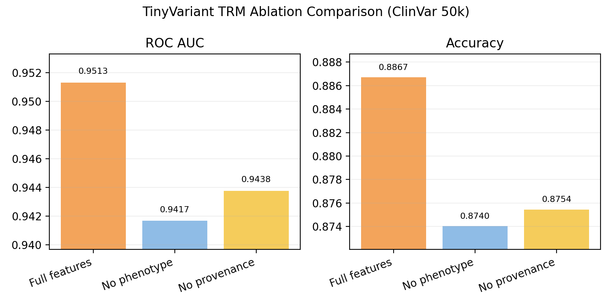

# TinyVariant: tiny recursion meets variant pathogenicity

Python 3.10 · PyTorch 2.0+ · Status: proof of concept · Hardware: RTX 3050

Hello! This repo started life as a fork of Samsung SAIT Montréal’s
**Tiny Recursive Models** project, the ARC-AGI puzzle solver. I wanted to see
if that clever recursive reasoning core could help with something far more
biological: guessing whether a DNA variant is pathogenic. Rather than rewrite
everything from scratch, I’m keeping the original TRM plumbing and layering a
bioinformatics proof of concept on top.

**Objective — test whether the Tiny Recursive Model’s halting/recursion stack helps ClinVar pathogenicity prediction. Final result (Oct 2025): logistic regression still wins (ROC AUC 0.959 / accuracy 0.896) while the best TRM run trails slightly (ROC AUC 0.951 / accuracy 0.887, ~17 M params).**

Along the way we proved a few things:

- The TRM architecture can be repurposed from ARC puzzles to real ClinVar data on commodity hardware (RTX 3050, 4 GB VRAM).
- A fully reproducible 100 k-variant pipeline (phenotypes, provenance, ablations, Hydra sweep tooling) fits in an open repo.
- Careful evaluation sometimes says “stick with the simple model” — and that clarity is a positive outcome.

> The core training loop, halting logic, and attention layout follow Samsung
> SAIT Montréal’s Tiny Recursive Models. We keep their architecture intact
> and swap the ARC puzzle inputs for ClinVar-derived feature tokens.

That’s it. If the approach shows promise, the plan is to grow TinyVariant into
a variant-analysis toolkit; if not, we pivot with a clear conscience.

---

## Key results

| Model / dataset slice | ROC AUC | Accuracy | Notes |
|-----------------------|--------:|---------:|-------|
| Logistic regression (baseline) | **0.959** | **0.896** | 80 k / 20 k train-test split, scikit-learn, one-hot + standard scaling |
| TRM (hidden_size 384, L_layers 2, L_cycles 2, lr 3e-4) | 0.951 | 0.887 | 17 M params, 2×2 recursion cycles; halting retained but delivers no uplift |
| TRM — phenotype ablation | 0.942 | 0.874 | Phenotype tokens collapsed to `<none>` |
| TRM — provenance ablation | 0.944 | 0.875 | Submitter/evaluation buckets neutralised |

The takeaway: the recursive reasoning stack ports successfully, but on ClinVar missense classification the linear baseline remains stronger. Recursion adds complexity without measurable gains — an insight that helps us focus effort where this architecture is likelier to shine.

## Where things stand right now

- ClinVar 50 k-per-class dataset (≈100 k total variants) is reproducible via the provided prep scripts; details live in `TinyVariant_log.md`.
- The logistic regression baseline remains the top performer on the current feature bundle (ROC AUC 0.959 / accuracy 0.896), giving us a strong yardstick for future ideas.
- The best TinyVariant/TRM configuration from the Hydra sweep keeps recursion shallow: `hidden_size=384`, `L_layers=2`, `L_cycles=2`, `lr=3e-4`, converging at ROC AUC 0.951 / accuracy 0.887 with ~17 M parameters.
- Phenotype and provenance ablations only dip a few points, suggesting the TRM encoder captures useful signal but the recursion/halting loop adds little over a single pass.
- Documentation, plots (`docs/figures/`), and logs now capture the negative result so we can pivot or publish with confidence and share the findings transparently.

---

## Quickstart (current state)

1. Activate the working environment:
   ```bash
   conda activate trm_env
   ```
2. Build the tiny ARC sanity dataset (already done once, but reproducible):
   ```bash
   PYTHONPATH=$(pwd) python -m dataset.build_arc_dataset \
       --input-file-prefix kaggle/combined/arc-agi \
       --output-dir data/arc1concept-mini \
       --subsets training evaluation \
       --test-set-name evaluation \
       --num-aug 0
   ```
3. (Optional sanity) Run the trimmed TRM config that fits on the RTX 3050:
   ```bash
   DISABLE_COMPILE=1 python pretrain.py \
       arch=trm \
       data_paths="[data/arc1concept-mini]" \
       epochs=2 eval_interval=2 \
       global_batch_size=4 \
       arch.hidden_size=128 arch.puzzle_emb_ndim=128 \
       arch.num_heads=2 arch.expansion=2 \
       arch.L_layers=1 arch.L_cycles=2 arch.H_cycles=1 \
       +run_name=debug_run_tiny
   ```
   You’ll see WandB logs and a checkpoint under `checkpoints/`. This just verifies the TRM plumbing; it is no longer a project milestone.

4. Rebuild the ClinVar dataset with phenotype/provenance context (5 k per class by default) and train the VariantTRM run (50 epochs, evaluator logs every 5 epochs):
   ```bash
   # Rebuild dataset after any feature changes (ClinSig columns are excluded by default)
   python tools/prepare_clinvar_dataset.py --max-per-class 5000
   python tools/build_clinvar_trm_dataset.py

   WANDB_MODE=offline DISABLE_COMPILE=1 \
   python pretrain.py --config-name cfg_clinvar_long +run_name=clinvar_long
   ```
   Add `+early_stop_patience=5` (and optional `+early_stop_metric`) to enable early stopping once the validation ROC AUC plateaus.  
   Variant sequences now contain 25 tokens covering gene/allele features, three phenotype buckets, evidence sources, submitter/evaluation buckets, five position digits, and a label slot.

5. Baseline comparison (logistic regression on the same split — still the strongest performer):
   ```bash
   python tools/train_baseline_logreg.py \
       --input data/clinvar/processed/clinvar_missense_balanced.tsv \
       --output outputs/clinvar_logreg_metrics.json
   ```

6. Sanity test (ensures no ClinicalSignificance leakage):
   ```bash
   python -m pytest tests/test_clinvar_dataset.py
   ```
   (Requires the balanced ClinVar TSV under `data/clinvar/processed/clinvar_missense_balanced.tsv`.)

7. Evaluate checkpoints (CPU or CUDA — pick manually until the scripts learn to fall back automatically):
   ```bash
   python tools/evaluate_clinvar_checkpoint.py \
       --config checkpoints/Clinvar_trm-ACT-torch/clinvar_long_20251024-175518/all_config.yaml \
       --checkpoint checkpoints/Clinvar_trm-ACT-torch/clinvar_long_20251024-175518/step_1248 \
       --device cuda \
       --output outputs/clinvar_trm_metrics.json \
       --save-preds outputs/clinvar_trm_predictions.jsonl
   ```
   (Set `--device cpu` if GPUs are unavailable.)

8. Generate documentation plots (optional):
   ```bash
   python scripts/plot_eval_comparison.py \
       --trm outputs/clinvar_trm_metrics.json \
       --baseline outputs/clinvar_logreg_metrics.json \
       --output docs/figures/clinvar_metric_comparison.png

   python scripts/plot_roc_curve.py \
       --preds outputs/clinvar_trm_predictions.jsonl \
       --output docs/figures/clinvar_trm_roc.png
   ```
   (Both scripts default to displaying the figure if `--output` is omitted.)

9. Optional feature ablations:
   ```bash
   # Phenotype-only ablation
   python tools/build_clinvar_trm_dataset.py --phenotype-ablation

   # Provenance ablation (submitter/eval buckets)
   python tools/build_clinvar_trm_dataset.py --provenance-ablation
   ```
   Re-run the baseline/TRM commands against `data/clinvar/processed/clinvar_trm` after each ablation to measure impact.

10. Scale to larger datasets (e.g., 50k per class):
    ```bash
    python tools/prepare_clinvar_dataset.py --max-per-class 50000
    python tools/build_clinvar_trm_dataset.py
    ```
    Expect longer preprocessing/training time and higher disk usage when increasing `--max-per-class`.

11. Hyperparameter sweep (used to find the 384 / 2×2 / 3e‑4 setting)
    ```bash
    WANDB_DISABLED=true TINYVARIANT_NUM_WORKERS=0 DISABLE_COMPILE=1 \
    python pretrain.py --config-name clinvar_sweep --multirun

    python scripts/analyze_sweep.py
    ```
    Review `sweep_summary.csv` and the generated heatmap (`docs/figures/clinvar_sweep_heatmap.png`). The best configuration so far keeps recursion shallow: hidden_size=384, L_layers=2, L_cycles=2, lr=3e-4 → ROC AUC ≈ 0.951, accuracy ≈ 0.887 (~17 M parameters, run `clinvar_long_best384_20251026-140402`).

12. Further analysis (optional)
    - **Feature ablation comparison** – after running phenotype/provenance ablations, compare `outputs/*_metrics.json` files to quantify each feature family’s contribution.
      ```bash
      python scripts/plot_trm_ablation.py \
          --full outputs/clinvar_trm_metrics.json \
          --no-phenotype outputs/clinvar_long_phenotype_ablation_20251024-215110_metrics.json \
          --no-provenance outputs/clinvar_long_provenance_ablation_20251025-074717_metrics.json \
          --output docs/figures/clinvar_trm_ablation_comparison.png
      ```
      
    - **Per-variant inspection** – use `tools/evaluate_clinvar_checkpoint.py --save-preds` to slice predictions by phenotype, gene, or review status.

---

Questions, ideas, or words of caution? Pop them into the issue tracker or reach out directly. Thanks for following the TinyVariant proof-of-concept all the way to its conclusion.
